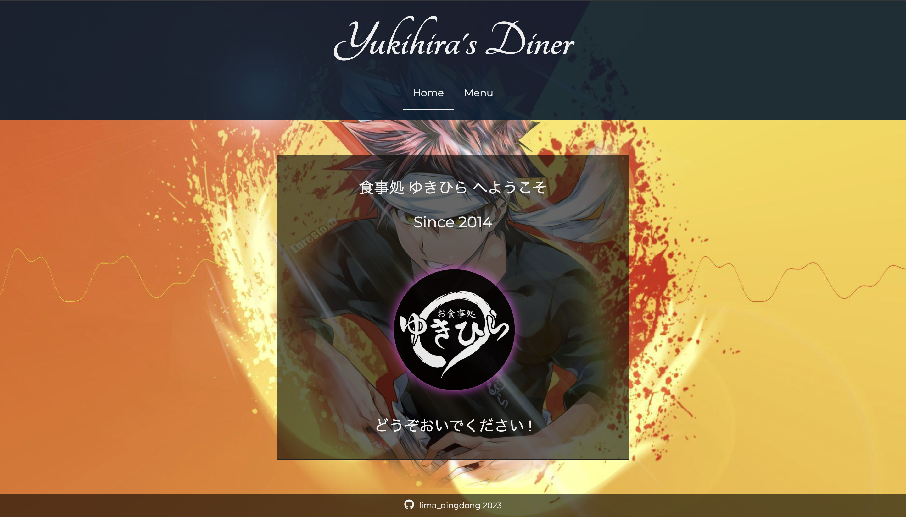

# TOP_JS
This repo contains products and practices for web programming from The Odin Project's Full Stack Javascript course.
 
It touches on Javascript, React (libraries and frameworks like styled-components and react-redux), advanced HTML/CSS, NodeJS (MongoDB & Express)

### Some Sample Work
Here are some of the better ones I've done as exploration:

A simple website where I explore more about advanced HTML/CSS
 

 
A responsive website in React where I make a deep-dive into React applications. Click here to see more!
 

